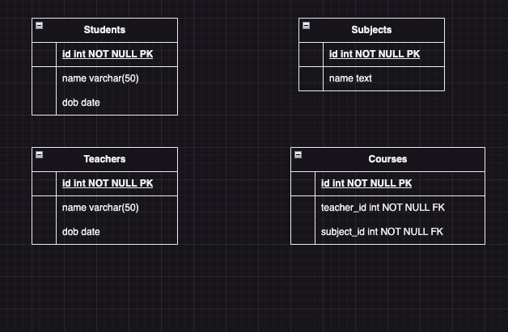

# drawio2go

This is a toy project I've built to practice programming in Go.
The tool generates the code for a basic REST API using Gin. It also generates the SQL commands in order to create and manage data in a Postgres database.
It uses an ERD built in a tool called [draw.io](https://www.drawio.com/). Certain conventions must be followed in order for the tool to work.
As this is just a toy project which I wanted to build to do something with a bit of a challenge, I don't intend to work any further on it.

How it works:

- pass an erd made in draw.io to the tool with the following command:
 `go run main.go generate test-app ./erd_example.drawio /output-path`

 The erd must follow these rules:

 * Fields must be defined each in one string, eg. customer_name varchar(50) NOT NULL
 * Primary key fields must be named id, eg id int NOT NULL PK
 * Foreign keys must be named as the table they make reference to, followed by _id, eg student_id int NOT NULL FK, to reference the table students

 

 